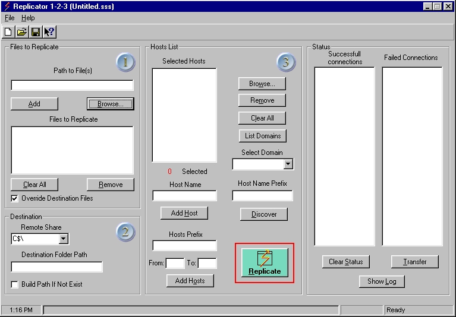



## Easy File Replicator\.

### Description

Another one for NT administrators. Replicator 1-2-3 is a utility that allows you to replicate one or more files to a number of remote hosts. It comes handy when you need to quickly update files with a new version or simply push a script or utility to your desktop machines, or servers. Replicator has a simple one screen interface. Three step pointers are added for easy navigation. Full feature command line options support running replicator from a batch. Comes handy, when you need to schedule the replication with AT, WinAT or similar programs.
 
### More Info
 

             |
---                |---
**Submitted On**   |2001-12-26 22:16:02
**By**             |[Gurgen Alaverdian](https://github.com/Planet-Source-Code/PSCIndex/blob/master/ByAuthor/gurgen-alaverdian.md)
**Level**          |Intermediate
**User Rating**    |5.0 (20 globes from 4 users)
**Compatibility**  |VB 6\.0
**Category**       |[Complete Applications](https://github.com/Planet-Source-Code/PSCIndex/blob/master/ByCategory/complete-applications__1-27.md)
**World**          |[Visual Basic](https://github.com/Planet-Source-Code/PSCIndex/blob/master/ByWorld/visual-basic.md)
**Archive File**   |[Easy\_File\_4412112262001\.zip](https://github.com/Planet-Source-Code/gurgen-alaverdian-easy-file-replicator__1-30142/archive/master.zip)

